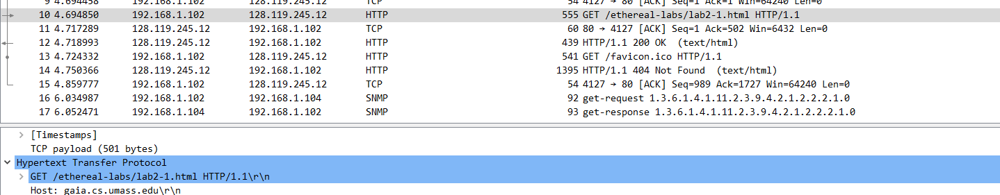
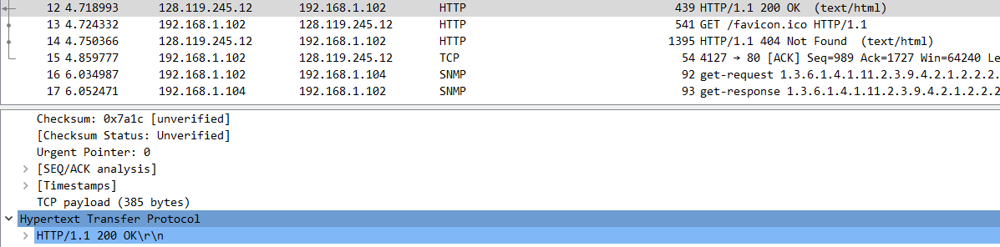
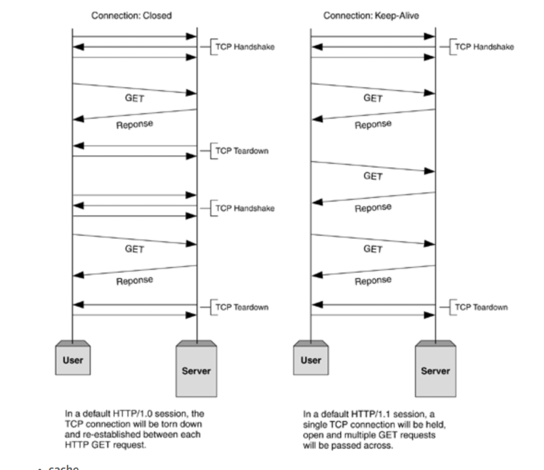
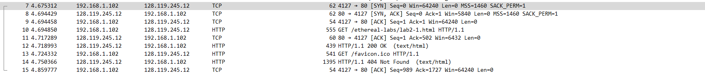
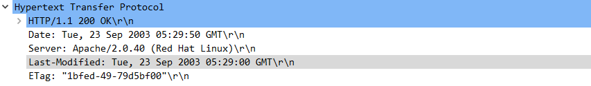
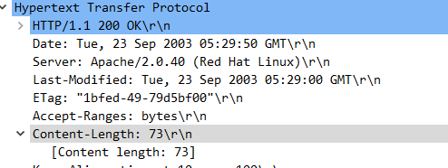

# HW #1

**1. client 컴퓨터의 브라우저가 HTTP버전 1.0 과 1.1 중 어떤 것을 실행하고 있습니 까? 그리고server에서 실행 중인 HTTP버전은 무엇입니까?**

>Client 와 Server 둘다 **HTTP 1.1** 을 사용한다. 

이는 다음과 같이 각각 **Client**가 GET 방식으로 서버에 요청한 HTTP를 확인하고 

이를 **서버가** 응답해준 부분을 확인하면 된다.

**2. HTTP 1.0과 HTTP 1.1의 차이점은 무엇입니까?**

`HTTP 1.0`은 **open / operation / close** 형태로 작동하며 operation이 끝날 때 바로 세션을 종료시킨다.

`HTTP 1.1`은 **Consistent Connection**을 지원하며 **HTTP Pipelining**을 지원한다.

우리에게 주어진 패킷들에서는 다음과 같이 **지속적 연결상태가 HTTP 통신 할때 유지가 되는 것을 확인 할 수 있었다.**

**3. client 컴퓨터의 IP주소는 무엇입니까?**
> 192.168.1.102

그림에서 보이다 싶히 source 부분이 `192.168.1.102`인 패킷이 request를 보내고 destination이 `192.168.1.102`인 패킷이 response를 받는다. 

**4. client 가 server에서 마지막으로 수정된 HTML파일을 검색한 것은 언제입니까? (첫번째 요청의 경우)**
> **2003년 9월 23일 화요일 05:29 GMT**

**5. 첫번째 HTTP GET에 대해 Client브라우저로 반환되는 contents는 몇 byte 입니까?.**

> 73 byte

